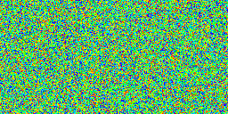
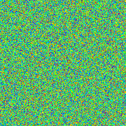
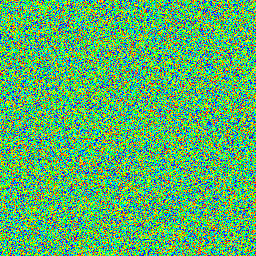

# sorting-visualization

[](https://godoc.org/github.com/invzhi/sorting-visualization)
[](https://goreportcard.com/report/github.com/invzhi/sorting-visualization)
[]()

Inspired by [FishyMcFishFace](https://imgur.com/t/rainbow/RM3wl) on [Hacker News](https://news.ycombinator.com/item?id=15423202).

More:

- [Sorting Algorithms Visualized](https://imgur.com/a/voutF)
- [Sorting Algorithms Revisualized](https://imgur.com/gallery/GD5gi)
- [How I Visualized Sorting Algorithms and Brought Them to Life with Sound
](https://medium.freecodecamp.org/how-i-visualized-the-sorting-algorithms-and-brought-them-to-life-with-sound-ce7c5c6cb6ef)

## Usage
```
Usage of ./sorting-visualization:
  -delay int
    	successive delay times, one per frame, in 100ths of a second (default 10)
  -filename string
    	GIF's filename (default: sorting name)
  -height int
    	GIF's height (default 256)
  -sorting string
    	selection, insertion, shell, merge, quick, bubble, radix, all
  -weight int
    	GIF's weight (default 256)
```

## GIFs

### Selection Sort


### Bubble Sort


### Insertion Sort


### Shell Sort


### Merge Sort


### Quick Sort


### Heap Sort


### Radix Sort

